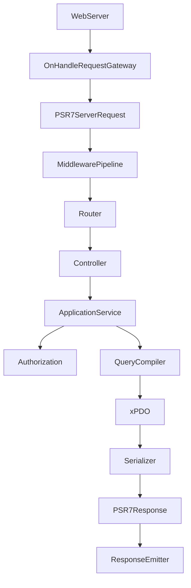

# mxHeadless Architecture

## 1. Goals

mxHeadless provides a modern, security-first REST API for MODX Revolution 3 that:

- Exposes MODX resources, pages, and registered xPDO objects as JSON
- Integrates with MODX service container, ACL, contexts, cache, and events
- Allows third-party Extras to register objects without coupling to mxHeadless core
- Remains fully open source with no artificial limitations

## 2. Non-goals

- Not a wrapper around legacy `modRest` / `modRestClient`
- Not an ExtJS connector or processor JSON API
- Not a generic raw SQL or arbitrary class exposure layer
- Not JSON:API in v1 (optional future representation only)
- Not an OAuth2 authorization server

## 3. MODX 3 integration

MODX 3 provides:

- Pimple-based DI container at `$modx->services` (PSR-11)
- Outgoing PSR-7/17/18 HTTP via Guzzle
- `modRequest` / `modResponse` for traditional web requests (not PSR-15)
- xPDO 3.x for data access
- Context ACL, resource policies, sessions, cache manager

mxHeadless registers via namespace `bootstrap.php` and intercepts API requests through `OnHandleRequest` before resource resolution.

## 4. Request lifecycle



## 5. HTTP gateway

**Primary:** Plugin on `OnHandleRequest` matches configured API prefix (default `/api`) and delegates to `MxHeadless\Application`.

**Fallback:** `assets/components/mxheadless/api.php` bootstraps MODX and runs the same application for hosts without friendly URL rewrite.

Both paths share `ResponseEmitter` and contain no business logic.

See [decisions/0001-http-gateway.md](decisions/0001-http-gateway.md).

## 6. PSR usage

| Standard | Usage |
|----------|-------|
| PSR-7 | Request/response messages |
| PSR-17 | Factories from MODX container when available |
| PSR-11 | Service registration in `$modx->services` |
| PSR-15 | Middleware pipeline |
| PSR-3 | Logging via MODX log adapter |
| PSR-18 | Webhook HTTP delivery |

## 7. Middleware order

1. Error boundary
2. Trusted proxy
3. Request ID
4. Body/URI limits
5. Content negotiation
6. CORS
7. Rate limit
8. Routing
9. Authentication
10. CSRF (session mutations)
11. Authorization
12. Validation
13. Dispatch
14. HTTP cache (safe GET)

## 8. Application layer

Controllers are thin. Application services implement use cases:

- `ListResources`, `GetResource`, `CreateResource`, …
- `GetPageByUri`
- `ListObjects`, `GetObject`, …

HTTP arrays never pass directly into xPDO. Typed query objects compile to safe xPDO queries.

## 9. ObjectRegistry

Public API names map to explicitly registered `ObjectDefinition` instances. No auto-exposure of xPDO classes.

```php
$api->registerObject('resources', ObjectDefinition::create()
    ->class(modResource::class)
    ->readable()
    ->fields(['id', 'pagetitle', 'uri', ...])
    ->filterable(['parent', 'published', ...])
);
```

## 10. ObjectDefinition

Describes: xPDO class, fields, filters, sorts, relations, searchable fields, mutation flags, field policies, serializers, context policy.

## 11. Query engine

`QueryParser` converts HTTP query params to `ObjectQuery`. `XpdoQueryCompiler` validates against definition whitelist and builds `xPDOQuery` with bindings only.

Relations use `getCollectionGraph()` for to-one; to-many uses paginated parent IDs + batch graph load to avoid N+1 and incorrect SQL limits.

## 12. Serialization

Projection-first: authorization resolves visible fields before query `select()`. `XpdoObjectSerializer` never loads then strips secrets.

## 13. Authentication

`Identity` types: anonymous, session, API key. API keys: lookup ID + hashed secret, scopes, expiry, revocation.

## 14. Authorization

Combines API scope + MODX user permission + context ACL + object/field/relation policy. Public content API is separate from admin API.

## 15. Contexts

Context from header `X-Context` or query `context` (whitelisted). Default `web`. Cross-context access requires explicit permission.

## 16. TVs

`TvProviderInterface` with explicit `?include=tv` or `tv_fields`. No automatic TV exposure.

## 17. Media

URLs via Media Sources. No filesystem paths in responses.

## 18. Caching

`ModxCacheAdapter` with separate namespaces for definitions, schema, and safe public GET. Keys include auth visibility. Mutations invalidate tags.

## 19. Webhooks

Transactional outbox. HMAC-SHA256 signed payloads. SSRF-protected delivery. Cron worker for retries.

## 20. Rate limiting

`FileRateLimiter` default (MODX file cache). Pluggable `RateLimiterInterface`.

## 21. Security

Deny-by-default. See [security.md](security.md).

## 22. Performance

Query count tests for 10/100/1000 resources. `max_limit`, `max_include_depth`, `max_fields` enforced.

## 23. Extension API

`ExtensionApi`: `registerObject`, `registerRelation`, `registerEndpoint` (callable handler). Planned: `registerSerializer`, `registerFilter`, `registerPermission`, `registerWebhookEvent`.

Event: `OnMxHeadlessRegister`.

## 24. YandexMapsLocator integration

Extra registers `locations` object via Extension API. No core dependency.

## 25. MiniShop3 integration

Extra registers `products`, `categories`, `orders`, etc. No core dependency.

## 26. API versioning

`/api/v1` only in initial release. Breaking changes require `/api/v2`.

## 27. OpenAPI

Static spec in `openapi.yaml` for repo CI and client generation. Runtime catalog planned: `GET /api/v1/meta/endpoints` and `GET /api/v1/meta/openapi` generated from routes and `ObjectRegistry`. See [ADR 0007](decisions/0007-live-openapi.md) and [mxApi adoption roadmap](roadmap/mxapi-adoption.md).

## 28. JSON response strategy

```json
{
  "data": {},
  "meta": { "total": 100, "limit": 20, "offset": 0 },
  "links": {}
}
```

Errors: RFC 9457 `application/problem+json`.

## 29. JSON:API evaluation

Rejected for v1. Custom envelope is simpler for headless frontends and xPDO mapping. Serializer layer allows optional JSON:API later.

See [decisions/0004-json-api.md](decisions/0004-json-api.md).

## 30. HTTP caching

Strong ETag on canonical public GET JSON. `If-None-Match` → 304. Authenticated/preview: `Cache-Control: private, no-store`.
